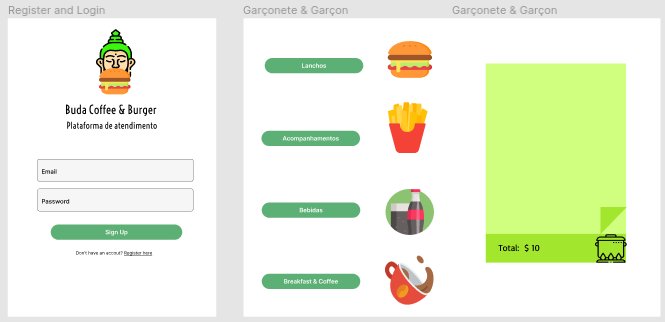

## Burger Queen - Laboratória Front-end
A plataforma visa auxiliar restaurantes com grande número de clientes a organizar melhor seus pedidos facilitando o trabalho dos funcionários. Sua construção é um dos projetos que compõem o bootcamp da Laboratória, nele aprendemos a utilizar o react aprimoramos nossa capacidade de componetização do código, aprendemos react Hooks e trabalhamos com algumas bibliotecas abaixo citadas

# Buda Vegan Burger
Sidarta (Buda), propagou seus conhecimentos sobre a terra, ele quer acabar com o sofrimento de qualquer espécie. 
Nossa lanchonete e Cafeteria é vegana, evitando sofrimento animal e trazendo alegria.

***

### Prototipação
Nosso protótipo de baixa fidelidade foi feito no figma. 

***

### Técnicos 
* FireBase database;
* FireBase Hosting;
* React;
* JavaScript;
* CSS;
* react-modal (Lib);
* react-burger-menu (Lib);
